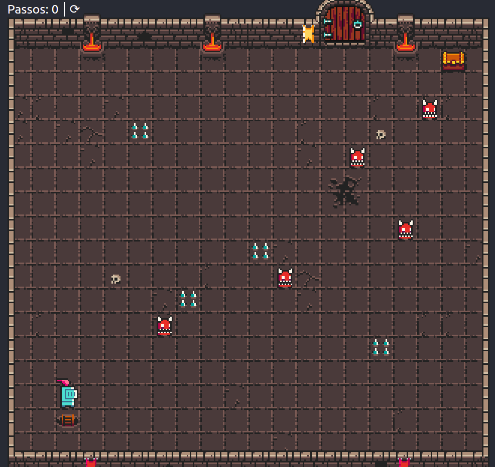

        
    <h1>JS4Gamers</h1>  
    
💪 Aplicação construída na Semana #MissãoPrimeiroEmprego da Heroway
    
    
    
    

        
        
        
        
        
    
     
    

        
    

# About

Tela

 

# Techs

 - [Javascript](https://developer.mozilla.org/pt-BR/docs/Web/JavaScript)

# Requirements

- [Git](https://git-scm.com/) installed
- [Live Server](https://marketplace.visualstudio.com/items?itemName=ritwickdey.LiveServer) installed

# Usage

- Run `npm install` or `yarn install`.
- Run `Live Server` and access `http://127.0.0.1:5500/`

# Authors

<h2 id="author"> 💻 Author </h2>

 
 
 
 

# Realização
- [Heroway](https://heroway.com.br/)

 
 

  <h1>Open Source</h1>
  Copyright © 2021-present, brunnosena.
  
JS4Gamers <a href="https://github.com/brunnosena/discord-clone/tree/dev/LICENSE">is MIT licensed 💖</a>

  

